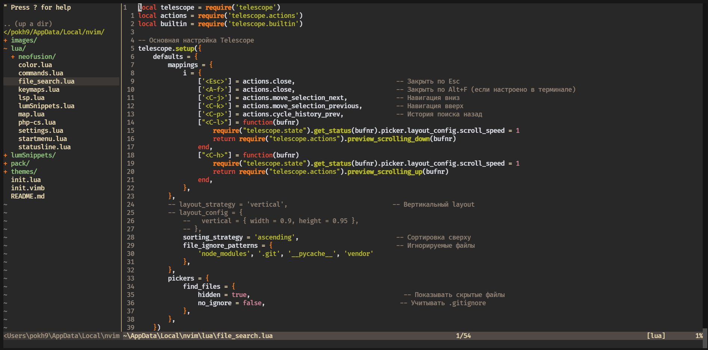
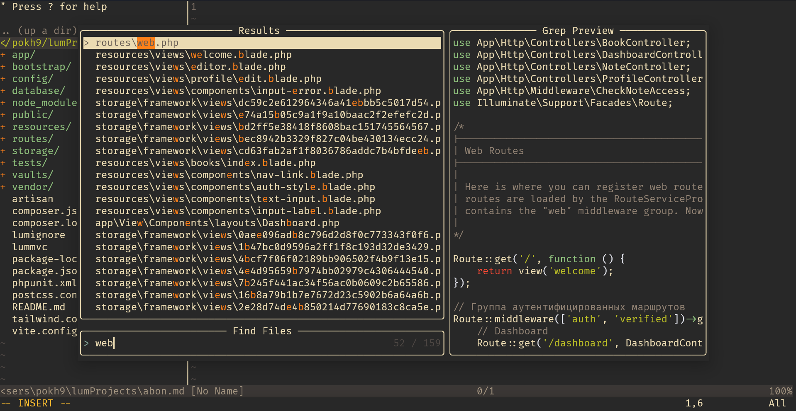
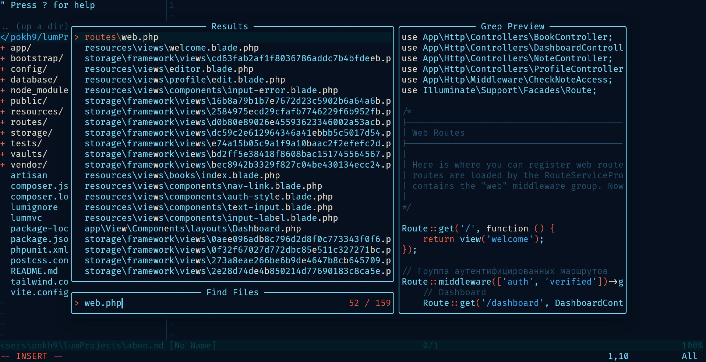

# Описание
Моя конфигурация, работает с nvim версии 0.5.0 ввиду наличия lsp config
Мне хотелось использовать по минимуму сторонних плагинов, и добиться максимальной автономности моего nvim, для работы приемущественно с PHP
На данный момент используется тема gruvbox, но они периодически меняются





## Менеджер плагинов
Мне намного удобнее утсанавливать плагины руками + плюс их не так много, так что все плагины устанавливаются прямо в директорию конфига. Список используемых здесь плагинов:
- [nerdtree](https://github.com/preservim/nerdtree)
- [emmet-vim](https://github.com/mattn/emmet-vim)
- [nvim-lspconfig](https://github.com/neovim/nvim-lspconfig)
- [plenaty.nvim](https://github.com/nvim-lua/plenary.nvim)
- [telescope.nvim](https://github.com/nvim-telescope/telescope.nvim)
- [vim-commentary](https://github.com/tpope/vim-commentary)


## Установка
Склонировать данный репозиторий в директорию конфига.
linux/mac:
```
~/.config/nvim
```
windows:
```
~\AppData\Local\nvim
```
Установить lsp:
```
npm install -g intelephense
```

Так же необходимо установить утилиту fd примеры для систем:
```
winget install sharkdp.fd
brew install fd
pacman -S fd
apk add fd
dnf install fd-find
api istall fd

dnf copr enable tkbcopr/fd
dnf install fd
```


<!-- # vim-plug -->
<!-- linux/mac -->
<!-- ~~~ -->
<!-- sh -c 'curl -fLo "${XDG_DATA_HOME:-$HOME/.local/share}"/nvim/site/autoload/plug.vim --create-dirs \ -->
<!--        https://raw.githubusercontent.com/junegunn/vim-plug/master/plug.vim' -->
<!-- ~~~ -->
<!-- windows(powershell) -->
<!-- ~~~ -->
<!-- iwr -useb https://raw.githubusercontent.com/junegunn/vim-plug/master/plug.vim |` -->
<!--     ni "$(@($env:XDG_DATA_HOME, $env:LOCALAPPDATA)[$null -eq $env:XDG_DATA_HOME])/nvim-data/site/autoload/plug.vim" -Force -->
<!-- ~~~  -->
<!-- in nvim: -->
<!-- ~~~ -->
<!-- PlugInstall -->
<!-- ~~~ -->


<!-- # packer -->
<!-- linux/mac -->
<!-- ~~~ -->
<!-- git clone --depth 1 https://github.com/wbthomason/packer.nvim\ -->
<!--  ~/.local/share/nvim/site/pack/packer/start/packer.nvim -->
<!-- ~~~ -->
<!-- windows(powershell) -->
<!-- ~~~ -->
<!-- git clone https://github.com/wbthomason/packer.nvim "$env:LOCALAPPDATA\nvim-data\site\pack\packer\start\packer.nvim" -->
<!-- ~~~ -->
<!-- in nvim: -->
<!-- ~~~ -->
<!-- PackerSync -->
<!-- ~~~ -->
