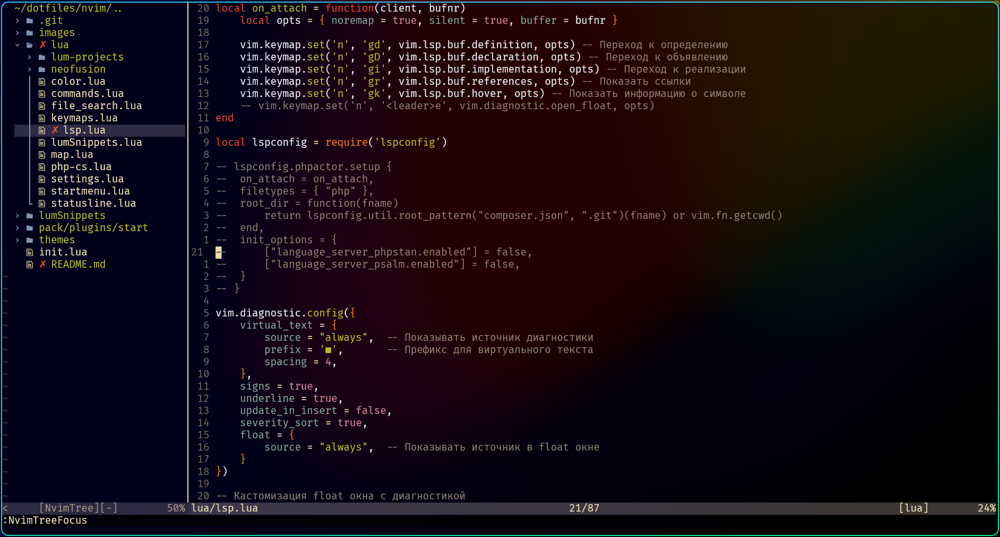
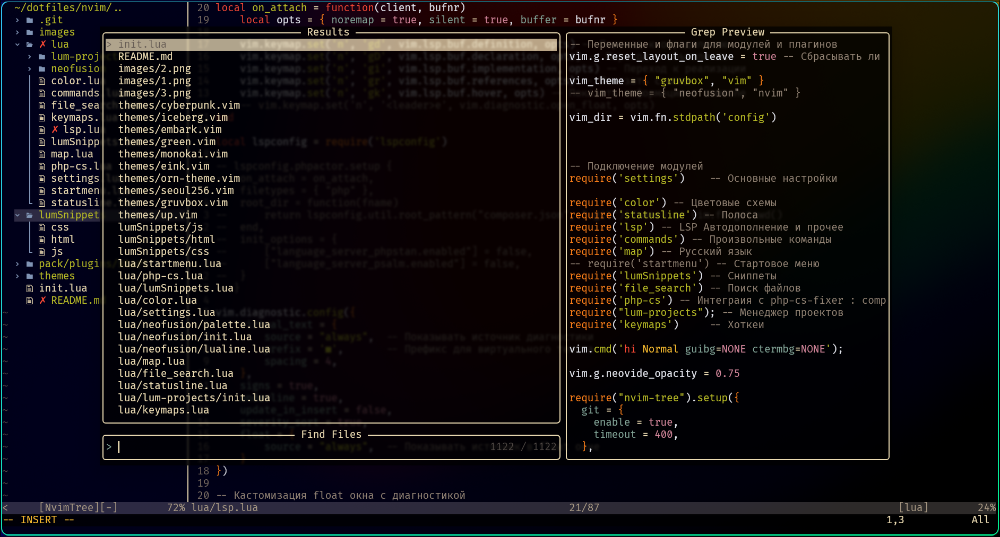

# Описание
Моя конфигурация, работает с nvim версии 0.5.0 ввиду наличия lsp config
Мне хотелось использовать по минимуму сторонних плагинов, и добиться максимальной автономности моего nvim, для работы приемущественно с PHP
На данный момент используется тема gruvbox, но они периодически меняются

## Менеджер плагинов
[lnpm.nvim](https://github.com/Lumetas/lnpm.nvim)


- [nvim-tree](https://github.com/nvim-tree/nvim-tree.lua)
- [emmet-vim](https://github.com/mattn/emmet-vim)
- [nvim-lspconfig](https://github.com/neovim/nvim-lspconfig)
- [nvim-cmp](https://github.com/hrsh7th/nvim-cmp)
- [cmp-buffer](https://github.com/hrsh7th/cmp-buffer.git)
- [cmp-nvim-lsp](https://github.com/hrsh7th/cmp-nvim-lsp)
- [plenary.nvim](https://github.com/nvim-lua/plenary.nvim)
- [telescope.nvim](https://github.com/nvim-telescope/telescope.nvim)
- [vim-commentary](https://github.com/tpope/vim-commentary)
- [nvim-dap](https://github.com/mfussenegger/nvim-dap)
- [nvim-dap-ui](https://github.com/rcarriga/nvim-dap-ui.git)
- [nvim-orgmode](https://github.com/nvim-orgmode/orgmode)
- [hop.nvim](https://github.com/hadronized/hop.nvim)
- [nvim-ufo](https://github.com/kevinhwang91/nvim-ufo)
- [yazi.nvim](https://github.com/mikavilpas/yazi.nvim)
- [nvim-web-devicons](https://github.com/nvim-tree/nvim-web-devicons)
- [promise-async](https://github.com/kevinhwang91/promise-async)
- [nvim-bqf](https://github.com/kevinhwang91/nvim-bqf)
- [startup.nvim](https://github.com/max397574/startup.nvim)
- [nvim-treesitter](https://github.com/nvim-treesitter/nvim-treesitter.git)
<!-- - [barbar.nvim](https://github.com/romgrk/barbar.nvim) -->
- [vim-fugitive](https://github.com/tpope/vim-fugitive)
- [supermaven](https://github.com/supermaven-inc/supermaven-nvim)


## Установка
Склонировать данный репозиторий в директорию конфига.
linux/mac:
```
~/.config/nvim
```
windows:
```
~\AppData\Local\nvim
```
Установить lsp:
```
npm install -g intelephense
```

Так же необходимо установить утилиту fd примеры для систем:
```
winget install sharkdp.fd
brew install fd
pacman -S fd
apk add fd
dnf install fd-find
apt istall fd

dnf copr enable tkbcopr/fd
dnf install fd
```

Для использования xdebug Необходимо поставить vscode-php-debug Ввести в виме:
```
:LumInstallXdebug
```
# Галерея




