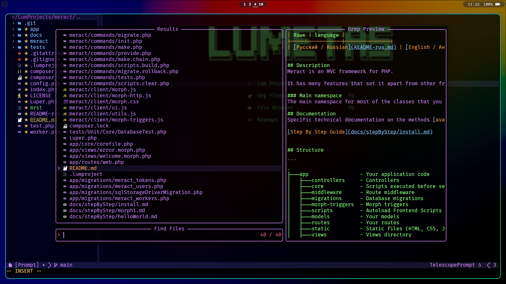

# leos.nvim
A Neovim theme.




## Installation
packer.nvim
```lua
use({
  "lumetas/leos.nvim",
  config = function()
    require("leos").setup()
  end,
})
```
or use your favorite plugin manager.

## Usage

```lua
require("leos").setup({
  terminal_colors = true,
  undercurl = true,
  underline = true,
  bold = true,
  italic = {
    strings = true,
    emphasis = true,
    comments = true,
    operators = false,
    folds = true,
  },
  strikethrough = true,
  invert_selection = false,
  invert_signs = false,
  invert_tabline = false,
  invert_intend_guides = false,
  inverse = true,
  contrast = "",
  palette_overrides = {},
  overrides = {},
})
```
